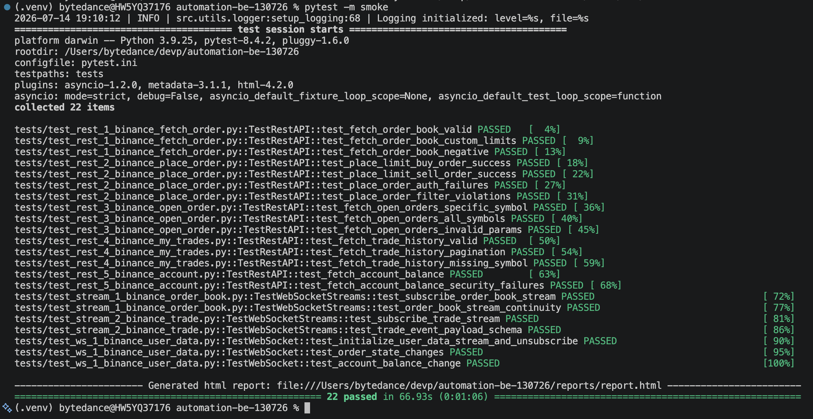

## Automation Backend (REST & STREAM WEBSOCKET)

## Getting Started

### How to Install Dependencies

1. **(Optional) Create a virtual environment:**
   ```bash
   python -m venv .venv
   source .venv/bin/activate  # On Windows use: .venv\Scripts\activate
   ```

2. **Install the required packages:**
   ```bash
   pip install -r requirements.txt
   ```

3. **Environment Setup:**
   Copy `.env.example` to `.env` and configure your API credentials and other settings.
   ```bash
   cp .env.example .env
   ```

## How to Run Tests

The tests are powered by `pytest`. Test configuration can be found in `pytest.ini`.

- **Run all tests:**
  ```bash
  pytest
  ```

- **Run tests in a specific file:**
  ```bash
  pytest tests/test_rest_1_binance_fetch_order.py
  ```

- **Run tests with a specific marker** (e.g., rest, stream, smoke):
  ```bash
  pytest -m smoke
  ```

- **Run tests and generate an HTML report:**
  ```bash
  pytest --html=reports/report.html
  ```

## Latest Test Result



## Test Scope

### 1. Spot Trading API (REST)

- Fetch Order Book `(GET /api/v3/depth)`

- Place Limit Order `(POST /api/v3/order)`

- Fetch Open Orders `(GET /api/v3/openOrders)`

- Fetch Trade History `(GET /api/v3/myTrades)`

- Fetch Account Balance `(GET /api/v3/account)`

### 2. WebSocket (Market Data & Order Updates)

- Subscribe to the Order Book stream `(wss://stream.binance.com:9443/ws/<symbol>@depth)`

- Subscribe to the Trade stream `(wss://stream.binance.com:9443/ws/<symbol>@trade)`

- Subscribe to User Data stream `(wss://stream.binance.com:9443/ws via listenKey)`

## Notes

- `listenKey` was deprecated since 2026-01-21 https://github.com/binance/binance-spot-api-docs/blob/master/CHANGELOG.md.

- So I use ws userDataStream.subscribe.signature https://developers.binance.com/en/docs/catalog/core-trading-spot-trading/api/ws-api/user-data-stream#user-data-stream-subscribe-signature

## Test Case

- https://docs.google.com/spreadsheets/d/1ZWwr-0n3U1SmD1vXqWaByUSsn1oG2XTCa0xgYRCsY-s/edit?usp=sharing

## High Level Test Architecture

The automation framework is structured into source code (`src/`) and testing logic (`tests/`):

- **`src/` (Source Code):**
  - `src/core/`: Contains core configurations and setup logic.
  - `src/rest/`: Modules encapsulating interactions with REST APIs.
  - `src/stream/`: Modules handling regular WebSocket streams (e.g. order book, trades).
  - `src/ws/`: Modules handling User Data streams.
  - `src/utils/`: Helper functions, logging setup (using `loguru`), and generic utilities.
- **`tests/` (Test Suites):**
  - Contains the actual `pytest` suites.
  - Test files are sequentially numbered and grouped by domain (e.g., `test_rest_...`, `test_stream_...`, `test_ws_...`).
  - `conftest.py` manages shared test fixtures, environment configurations, and setup/teardown processes.
- **Reporting & Logging**:
  - Logs are generated by `loguru` and stored in the `logs/` directory.
  - Test reports can be generated in the `reports/` directory using `pytest-html`.

## Troubleshooting

### HTTP 451 Error in GitHub Actions
If you encounter `HTTP 451: Service unavailable from a restricted location` when running your tests in GitHub Actions, this is because GitHub's default runners are hosted in the **United States**, and Binance strictly geo-blocks US IP addresses (even for the Testnet).

**Workarounds:**
1. **Self-Hosted Runners:** Set up a [GitHub Actions self-hosted runner](https://docs.github.com/en/actions/hosting-your-own-runners) on a VPS located in a non-restricted region (e.g., Europe, Asia).
2. **Proxy Service:** If you have access to a proxy located outside the US, you can route the GitHub Action's traffic through it by configuring `HTTP_PROXY`, `HTTPS_PROXY`, and `ALL_PROXY` environment variables.
3. **Local Execution:** Run the test suite locally from your machine (if you are not in a restricted region), which should pass successfully.